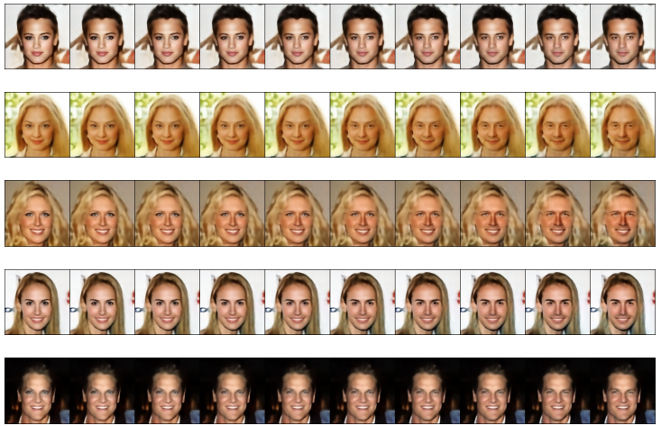

# **PROJET-MLA**

## **Description**
PROJET-MLA is a replication project based on the **Fader Network** model, which focuses on attribute manipulation for images. The goal is to modify specific attributes (e.g., gender, smile) while preserving the overall content of the image. This project involves data preprocessing, model implementation, training, and evaluation.




---

## **Features**
- **Image Attribute Editing**: Modify attributes such as gender, smile, and age on facial images.
- **Fader Network Replication**: Recreate the encoder-decoder architecture with adversarial training.
- **Data Preprocessing**: Handle datasets like CelebA and others for input preparation.
- **Evaluation and Visualization**: Measure model performance through accuracy, loss metrics, and generated images.

---

## Usage
1. **Preprocess the Dataset**: Prepare the CelebA dataset using the provided scripts.

   ```bash
   python dataset_preprocess.py

2. **Train the Classifier**

   ```bash
   python classifier.py 

3. **Train the Model**: 

   ```bash
   python train_fader.py 

4. **Generate Results**: Visualize attribute changes using the trained model.

   ```bash
   python interpolation_male.py
   
## Acknowledgments
Based on the Fader Network paper: Fader Networks: Manipulating Images by Sliding Attributes.

Dataset: CelebA (provided by MMLAB, CUHK).
